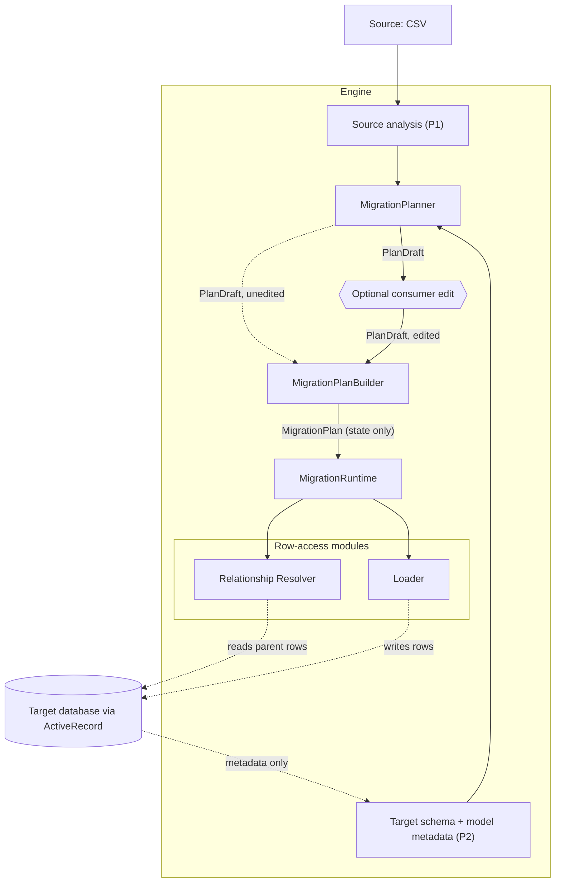

# Relational Data Migration Engine

> An assisted relational data migration engine for Rails applications. It discovers, maps, validates, transforms, and loads data into your database through ActiveRecord — with deterministic, explainable recommendations that produce a runnable plan you can edit, and options that let you say *how* a migration should behave while the engine handles the rest.

## About

Most of my backend work has involved data migrations that were never as simple as "read a CSV, insert rows" — large customer migrations (some north of 10 lakh records) from CSV/JSON exports, API-based migrations, and incremental syncs that had to keep running safely long after the initial load. Every one of them hit the same friction:

- Fields that didn't map cleanly onto the target schema
- The same value showing up in three different forms across customers
- Records that were invalid, missing, or silently blocked
- Foreign keys that only resolved correctly against the real state of the target database

The hard part was never parsing the input — it was everything around it: mapping source to target with enough confidence to explain *why* a mapping was chosen, catching bad data before it reached the database, resolving relationships deliberately, staying practical at volume, and being able to see what a migration would do before it does it. In practice that meant a new one-off script per migration, tightly coupled to a specific Rails app, unreusable, and opaque about why any decision was made.

This engine is the fix: a **contract-first relational data migration engine built on ActiveRecord**. You give it a source and a target model (or table) and set options for how it should behave. It reads the schema and model metadata, recommends a runnable plan, validates and transforms the data, resolves relationships deliberately, and loads — in a controlled, repeatable, reportable way, without you writing connections, lookups, or loaders.

## Architecture

The source and the target schema (including model metadata) are analyzed into formal schemas. The Planner recommends a plan as a draft: runnable *state*, plus optional *facts* explaining why. You can edit the draft or use it as-is. The Builder validates it into a state-only plan, and only that plan is executed. Planning never reads existing target rows; only the relationship resolver (reads parent rows) and the loader (writes rows) touch business data.

Within `MigrationRuntime`, execution runs in a fixed order: extract → map → transform → pre-resolution validation → relationship resolution → post-resolution validation → load → report.

This is a simplified view. The full topology, the Planner/Builder/Runtime boundary and the end-to-end sequence diagram are canonical in [`docs/architecture/overview.md`](docs/architecture/overview.md); every other doc refers back to that file.
