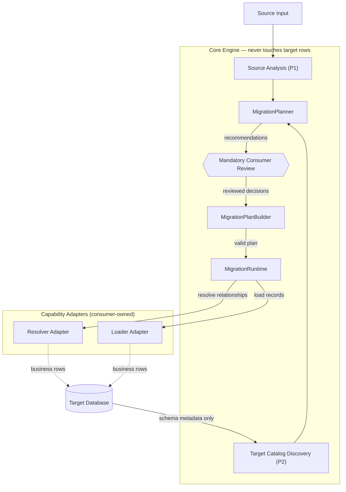

# Relational Data Migration Engine

> An assisted relational data migration engine that helps discover, map, validate, transform, and migrate data between relational systems — with deterministic recommendations and human review before execution.

## About

Most of my backend work has involved data migrations that were never as simple as "read a CSV, insert rows" — large customer migrations (some north of 10 lakh records) from CSV/JSON exports, API-based migrations, and incremental syncs that had to keep running safely long after the initial load. Every one of them hit the same friction:

- Fields that didn't map cleanly onto the target schema
- The same value showing up in three different forms across customers
- Records that were invalid, missing, or silently blocked
- Foreign keys that only resolved correctly against the real state of the target database

The hard part was never parsing the input — it was everything around it: mapping source to target with enough confidence to explain *why* a mapping was chosen, catching bad data before it reached the database, resolving relationships deliberately, staying practical at volume, and running migrations in reviewed phases with customer sign-off. In practice that meant a new one-off script per migration, tightly coupled to a specific Rails app or ORM, unreusable, and opaque about why any decision was made.

This engine is the fix: a **framework-independent, plain-Ruby, contract-first relational data migration engine**. It discovers source and target schemas, recommends mappings for human review, validates and transforms the data, resolves relationships deliberately, and only then executes — in a controlled, repeatable way, independent of any one application or ORM.

## Architecture

Source and target are analyzed into formal schemas, the Planner recommends a mapping for human review, and only a reviewed, built plan is ever executed. Core never touches a real target row directly — relationship resolution and loading are dispatched across a capability boundary to adapters, which are the only components allowed to reach actual target storage.

Within `MigrationRuntime`, execution runs in a fixed order: extract → map → transform → pre-resolution validation → relationship resolution (dispatched to the Resolver Adapter) → post-resolution validation → load (dispatched to the Loader Adapter).
