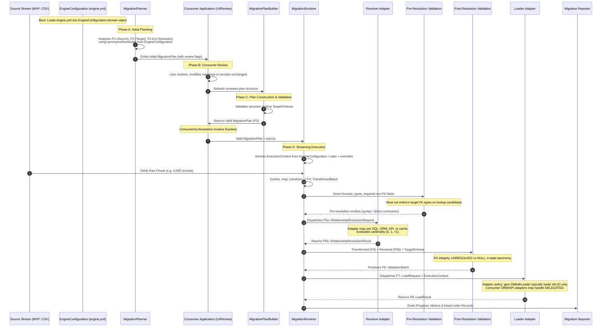

# Architecture Overview & System Topology

> **Document Location:** `docs/architecture/overview.md`  
> **Status:** Final & Frozen Architecture (v2.3)  
> **Index:** [Master Documentation Index](../../README.md)

---

## 1. Foundational Axioms & Architectural Principles

The **Relational Data Migration Engine** is designed around the following foundational axioms.

CSV is the **current MVP source adapter / input format**. It is not the system identity. The engine is a framework-independent relational data migration engine; additional source formats may be added later without changing the Core Planner → Builder → Runtime design.

### 1.1 The Hard Constraint: Zero Core Target-Row Access
The Core Engine will **never have direct access to the consumer's target business data or existing target rows**.

Target **schema discovery** is an explicitly authorized **structural** capability. Target **business rows** are not.

```text
Target Catalog Discovery
        ↓
TargetSchema
        ↓
Core Planner / Plan Builder / Validation (structural rules)

Target Business Rows
        ↓
NOT directly accessible by Core
        ↓
Capability Adapter only (resolver / loader)
```

* **What the Core Engine has access to:**
  * Target database catalog metadata (tables, columns, SQL types, PKs, FKs, nullability, unique constraints) via Target Catalog Discovery → `TargetSchema`.
  * Source data through the configured source adapter (MVP: CSV streams and bounded sampling buffers).
  * Optional application semantic declarations explicitly exposed by the consumer (`SemanticSchema`).
* **What the Core Engine MUST NOT assume or access:**
  * Existing target rows, target value distributions, target value overlaps, existing parent entities, live application state, or “is this table empty?” checks.
* **The Capability Boundary:**
  $$\text{Core Engine} \xrightarrow{\text{NO direct target-row access}} \text{Isolated}$$
  $$\text{Configured Capability Adapters} \xrightarrow{\text{Authorized & configured}} \text{Target DB / ORM / API Storage}$$

Catalog discovery may use a schema-only connection or catalog API. That is not a license for Core to `SELECT` business rows. Row lookups and persistence happen only across the capability boundary.

### 1.2 Target Schema Structural Truth Does NOT Imply Business Values
The target database catalog provides *structural truth* (column names, SQL types, nullability, PK/FK relationships, lengths, and defaults). It **does not provide arbitrary business-level domain values** for `VARCHAR` or `INTEGER` columns.
* For example, knowing a target column is `users.status VARCHAR(50)` does **not** tell the engine that allowed values are `["ACTIVE", "INACTIVE", "SUSPENDED"]`.
* Domain values are known to the engine **only** when explicitly declared by the consumer via `SemanticSchema`.

### 1.3 Tripartite Architecture: Planner → Consumer Review → Plan Builder → Runtime
The architecture strictly decouples planning, plan building, and execution:

```text
MigrationPlanner
        ↓
Initial MigrationPlan
        ↓
Consumer Review
        ↓
MigrationPlanBuilder
        ↓
Valid MigrationPlan
        ↓
MigrationRuntime
```

1. **`MigrationPlanner`:** Discovers facts, analyzes metadata, recommends mappings, surfaces uncertainties, and creates the **initial `MigrationPlan`**.
2. **`MigrationPlanBuilder`:** Constructs/reconstructs and validates a final valid **`MigrationPlan`** from decisions submitted by the consumer (whether the consumer changed mappings or accepted the Planner's recommendations unchanged). The Builder does **not** start the Runtime.
3. **`MigrationRuntime`:** Consumes and executes the valid **`MigrationPlan`**. It has no awareness of the Planner, the Builder, or consumer UI workflows. The consumer/application or orchestration layer decides when Runtime is invoked.

### 1.4 `MigrationPlan` as Domain Contract, Not Serialization Format
`MigrationPlan` (P3) is the **in-memory domain contract** between planning/building and execution.
* The Runtime consumes a valid `MigrationPlan` object directly.
* Formats such as JSON, YAML, or database-stored JSON are optional, thin serialization representations for storage or transport across network/CLI boundaries.
* The Runtime is never responsible for generic format parsing; it depends on a validated domain object.

### 1.5 Formal Data Contract / Protocol First, Implementation Second
In this project, **protocol** means a **formal data contract**: the structure, semantics, invariants, and allowed interaction between engine components.

It does **not** necessarily mean an HTTP API, REST API, or network protocol. JSON/YAML examples in the protocol documents are serialization illustrations of those contracts.

* Layers depend on these contracts—not on a chain of Ruby classes, ORM models, or database sockets.
* The Validator never depends on SQL connections or ORM gems.
* The Transformer never depends on PostgreSQL or CSV driver internals.
* The Loader adapter never knows Recommendation Engine scoring heuristics.
* Adapters interact solely via versioned contract payloads.

### 1.6 Deterministic Core
The Core recommendation and planning system must be:

* **deterministic**
* **explainable**
* **reproducible**
* **testable**

The Core Engine must not depend on LLMs or external AI services for correctness. Identical metadata and `EngineConfiguration` recommendation policies must produce identical recommendations.

---

## 2. System Architecture & Topology

```
┌────────────────────────────────────────────────────────────────────────────────────────┐
│                        FRAMEWORK-INDEPENDENT CORE ENGINE                               │
│        (Zero Target-Row Access • Pure Metadata & Transformation Engine)                │
│                                                                                        │
│  ┌──────────────────────────────────────────────────────────────────────────────────┐  │
│  │                    ENGINE-WIDE CONFIGURATION SUBSYSTEM                           │  │
│  │                                                                                  │  │
│  │  config/engine.yml ──► ConfigLoader & Validator ──► EngineConfiguration (Domain) │  │
│  │                                                            │ (Injected across all)│  │
│  └────────────────────────────────────────────────────────────┼─────────────────────┘  │
│                                                               │                        │
│  ┌────────────────────────────────────────────────────────────┼─────────────────────┐  │
│  │                    PLANNING & PLAN CONSTRUCTION SUBSYSTEM  ▼                     │  │
│  │                                                                                  │  │
│  │  P1: SourceSchema ──┐                                                            │  │
│  │  P2: TargetSchema ──┼──► MigrationPlanner ──► Initial MigrationPlan              │  │
│  │  P2-Ext: Semantic ──┘          │                                                 │  │
│  │                                │ Uses                                            │  │
│  │                                ▼                                                 │  │
│  │                 ┌─────────────────────────────┐                                  │  │
│  │                 │ Shared Plan Construction &  │                                  │  │
│  │                 │   Validation Primitives     │                                  │  │
│  │                 └──────────────┬──────────────┘                                  │  │
│  │                                ▲                                                 │  │
│  │                                │ Uses                                            │  │
│  │  Consumer Decisions ───────────┴──► MigrationPlanBuilder ──► Valid MigrationPlan │  │
│  │  (or Unchanged Recommendations)                                    │             │  │
│  └────────────────────────────────────────────────────────────────────┼─────────────┘  │
│                                                                       │                │
│                                                                       ▼ P3 Contract    │
│  ┌──────────────────────────────────────────────────────────────────────────────────┐  │
│  │                        STREAMING RUNTIME SUBSYSTEM                               │  │
│  │                                                                                  │  │
│  │   Extract → Map → Transform → Pre-resolution validation → P4: TransformedBatch   │  │
│  │                              │                                                   │  │
│  │                              ▼                                                   │  │
│  │                    Runtime Orchestrator ◄── (Derives ExecutionContext from       │  │
│  │                       │              │       EngineConfiguration + plan/overrides)│  │
│  │   P5a: RelResolutionRequest          │ P7: LoadRequest + ExecutionContext        │  │
│  │   then post-resolution / integrity → P6                                          │  │
│  └───────────────────────┼──────────────┼───────────────────────────────────────────┘  │
└──────────────────────────┼──────────────┼──────────────────────────────────────────────┘
                           │              │
═══════════════════════════╪══════════════╪═══════════════════════════════════════════════
                           │ CAPABILITY   │ CAPABILITY
                           │ BOUNDARY     │ BOUNDARY
═══════════════════════════╪══════════════╪═══════════════════════════════════════════════
                           ▼              ▼
┌──────────────────────────────────────┐  ┌─────────────────────────────────────────────┐
│     RESOLVER ADAPTER                 │  │         LOADER ADAPTER                      │
│   (Authorized for Target Lookups)    │  │       (Authorized for Persistence)          │
│                                      │  │                                             │
│  ┌────────────────────────────────┐  │  │  ┌───────────────────────────────────────┐  │
│  │ DbRelationshipResolver [gem]   │  │  │  │ DbBulkLoader [gem — generic SQL]      │  │
│  ├────────────────────────────────┤  │  │  ├───────────────────────────────────────┤  │
│  │ Consumer ORM Resolver [opt]    │  │  │  │ Consumer ORM Loader [opt]             │  │
│  ├────────────────────────────────┤  │  │  ├───────────────────────────────────────┤  │
│  │ Consumer Custom / API [opt]    │  │  │  │ Consumer Custom / API Loader [opt]    │  │
│  └────────────────┬───────────────┘  │  │  └───────────────────┬─────────────────┘  │
└───────────────────┼──────────────────┘  └─────────────────────┼──────────────────────┘
                    │                                           │
                    │ P5b: RelResolutionResult                 │ P8: LoadResult
                    ▼                                           ▼
┌──────────────────────────────────────┐  ┌─────────────────────────────────────────────┐
│ P6: ValidationBatch (Unified Verdict)│  │ P8: Migration Summary & Dead-Letter Log     │
└──────────────────────────────────────┘  └─────────────────────────────────────────────┘
```

The gem may provide generic framework-independent adapters (`DbRelationshipResolver`, `DbBulkLoader`). ORM, API, and application-specific adapters are **consumer-owned**. The gem does not require or promise them.

---

## 3. Planning, Plan Construction, and Execution Boundary

```
                  ┌────────────────────────────────────────┐
                  │       Shared Plan Construction &       │
                  │         Validation Primitives          │
                  └───────────┬────────────────┬───────────┘
                              ▲                ▲
                              │                │
            ┌─────────────────┘                └──────────────────┐
            │ Uses primitives                     Uses primitives │
            │                                                     │
 ┌─────────────────────┐                               ┌──────────────────────┐
 │   MigrationPlanner  │                               │  MigrationPlanBuilder│
 └──────────┬──────────┘                               └──────────▲───────────┘
            │                                                     │
            │ Creates initial plan                                │ Builds / validates
            ▼                                                     │ final plan
 ┌─────────────────────┐                                          │
 │Initial MigrationPlan│                                          │
 └──────────┬──────────┘                                          │
            │                                                     │
            └───────────────► ┌───────────────────┐ ──────────────┘
                              │  Consumer Review  │
                              │ (UI, Admin, API)  │
                              │                   │
                              │ [Change Decisions │
                              │        OR         │
                              │    No Changes]    │
                              └───────────────────┘
                                        │
                                        │ (Yields valid plan)
                                        ▼
                             ┌─────────────────────┐
                             │ Valid MigrationPlan │
                             └──────────┬──────────┘
                                        │
                                        │ Consumer / orchestration
                                        │ invokes Runtime
                                        ▼
                             ┌─────────────────────┐
                             │  MigrationRuntime   │
                             └──────────┬──────────┘
                                        │
                                        │ Dispatches to adapters
                                        ▼
                             ┌─────────────────────┐
                             │    Target Storage   │
                             └─────────────────────┘
```

### 3.1 `MigrationPlanner`
* **Input:** `SourceSchema` (P1), `TargetSchema` (P2), optional `SemanticSchema` (P2-Ext), and `EngineConfiguration` recommendation policies (synonyms, thresholds).
* **Responsibility:**
  * Discovers metadata facts.
  * Evaluates name similarity, type compatibility, format patterns, and single-attribute foreign key markers.
  * Recommends column mappings and relationship lookups where evidence exists.
  * Surfaces uncertainties, ambiguous candidates, and unmapped required target columns.
  * Constructs the **initial `MigrationPlan`**.
* **Non-Responsibilities:** Does not render UIs, does not persist plans, does not execute migrations, and does not invent business value mappings when source tokens might match target semantics directly.

### 3.2 `MigrationPlanBuilder`
* **Input:** Plan structure and decisions supplied by the consumer (mappings, added transforms, explicit value mappings, relationship lookup choices) and target schema metadata.
* **Responsibility:**
  * Constructs/reconstructs and validates a final, executable `MigrationPlan`.
  * Verifies structural completeness: all required non-null target columns are mapped, source columns exist, transforms exist in registry, and lookups target valid entities.
* **The "No-Change" Invariant:**
  * **"No consumer change" is a completely valid outcome.** If the consumer approves the Planner's recommendations without alteration, the Builder validates and instantiates the `MigrationPlan` directly from the initial plan's data structure.
* **Non-Responsibilities:** Does not make new recommendations, heuristic guesses, alter consumer decisions, or invoke `MigrationRuntime`.

### 3.3 Shared Plan Construction & Validation Primitives
Both `MigrationPlanner` and `MigrationPlanBuilder` internally utilize a shared set of lower-level domain primitives:
* **Validation Rules:** Validates that field names are syntactically valid, transformations are registered, and required fields are satisfied.
* **Plan Structural Types:** Value objects representing direct mappings, relationship lookups, and transform steps.
* Reusing these primitives guarantees that a plan constructed by the Planner and a plan reconstructed by the Builder obey identical contract invariants.

### 3.4 The Consumer Boundary
The consumer application or integration layer owns:
* Plan presentation (terminal UI, React admin dashboard, CLI prompts).
* User interaction and review workflows.
* Plan storage (saving plan YAML files, PostgreSQL JSON columns, S3 blobs).
* Network/API transport across client-server boundaries.
* **When** to invoke `MigrationRuntime` with a valid `MigrationPlan`.

The Core Engine provides the Planner, Builder, and Runtime. It does not mandate how the consumer manages review workflows or stores plans.

---

## 4. End-to-End Information Flow

Runtime execution order is explicit and must not be collapsed to “transform → resolve → validate → load”:

```text
Extraction
    ↓
Mapping
    ↓
Transformation
    ↓
Pre-resolution validation
    ↓
Relationship resolution
    ↓
Post-resolution / integrity validation
    ↓
Loading
```


