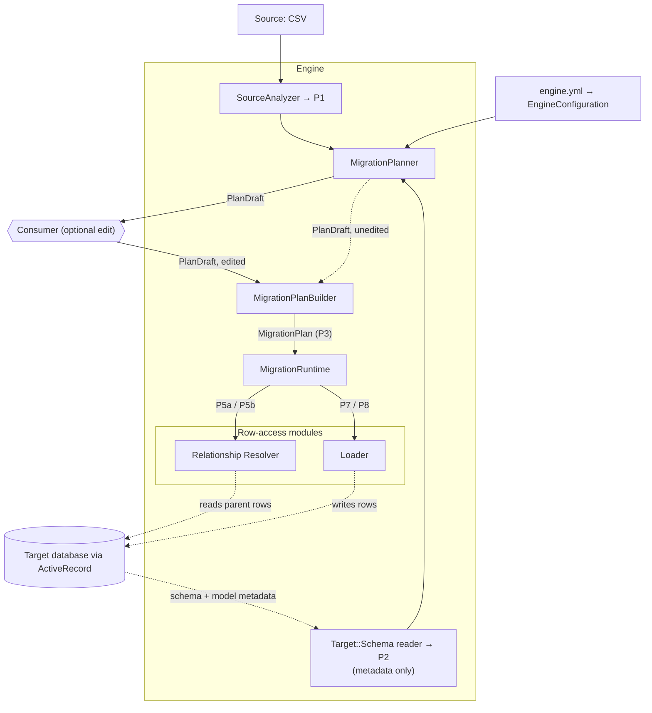
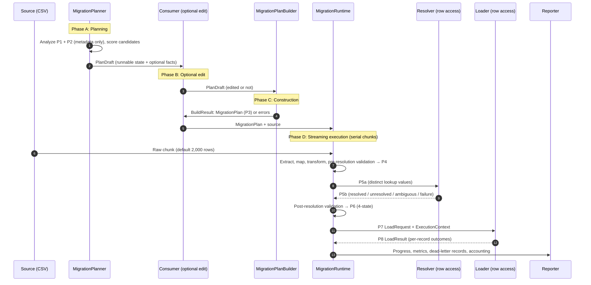

# Architecture Overview & System Topology

> **Document Location:** `docs/architecture/overview.md`
> **Status:** Draft v3.0 — rewritten 2026-10-08 for the ActiveRecord-based design (ADR-10, ADR-11)
> **Index:** [Master Documentation Index](../../README.md)

---

## 1. Foundational Principles

The **Relational Data Migration Engine** is a Rails-oriented gem that migrates data from a source file into a relational database through ActiveRecord. The consumer states *how a migration should behave*; the engine discovers, recommends, validates, resolves relationships and loads.

CSV is the **current MVP source format**. It is not the system identity; other source formats may be added later without changing the Planner → Builder → Runtime design.

### 1.1 Minimal Consumer Effort
The consumer does not write connections, resolvers, or loaders. They supply a source, name the target (a model or table), and set behavior options. Everything else is built in. Custom components exist only as an advanced extension point (see `target-access.md`).

### 1.2 The Row-Access Boundary (Zero Target-Row Access, as a Module Boundary)
Planning must never depend on what is already in the target database.

* **Allowed everywhere in the engine (metadata only):** columns, types, nullability, defaults, primary/foreign keys, unique indexes, and model metadata (enums, associations, virtual attributes, validators).
* **Forbidden outside the two row-access modules:** reading existing target rows, value distributions, value overlaps, existing parent entities, or "is this table empty?" checks.
* **Row-access modules:** only the **relationship resolver** (reads parent rows) and the **loader** (writes rows) may touch business rows. A test verifies that the Planner, Builder and pre-resolution stages never query rows.

### 1.3 Schema Is Structural Truth, Not Business Truth
The catalog says `users.status` is a `VARCHAR(50)`; it does not say which values are allowed. Allowed values are known only from model metadata (for example an `enum` declaration), never inferred from stored data.

### 1.4 Planner → Builder → Runtime, One Plan Format (ADR-01 amended by ADR-10)

```text
MigrationPlanner
        ↓
PlanDraft  (state + optional facts)
        ↓
[Optional consumer edit]
        ↓
MigrationPlanBuilder   (PlanDraft → BuildResult; reads only state)
        ↓
MigrationPlan (P3, state only)
        ↓
MigrationRuntime
```

1. **`MigrationPlanner`** discovers facts, recommends mappings and lookups, and produces a **`PlanDraft`**: a runnable `state` plus optional `facts` explaining it. It builds the draft through `MigrationPlanBuilder`'s own methods.
2. **`MigrationPlanBuilder`** is a pure function `PlanDraft → BuildResult`. It reads only `state`, never `facts`. Success carries the state-only `MigrationPlan`; failure carries errors (column, code, reason). It is used internally by the Planner and as a public API.
3. **`MigrationRuntime`** executes a `MigrationPlan`. It knows nothing about the Planner, the Builder, or `facts`.

Consumer review or editing between Planner and Builder is **optional** and consumer-owned. The Planner's draft may go straight to `build`.

### 1.5 Plan as Domain Object
`MigrationPlan` is an immutable in-memory object consumed directly by the Runtime. JSON or YAML are optional serializations for storage or transport. The Runtime never parses formats.

### 1.6 Contracts Between Components
Stages communicate through explicit value objects (P1–P8, `PlanDraft`, `BuildResult`) and not through shared mutable state or ad hoc hashes. Only artifacts that cross a process or storage boundary (`SourceSchema`, `TargetSchema`, `PlanDraft`, `MigrationPlan`, the run report) carry a `protocol_version`. In-process objects (P4 to P8) do not. See `protocols.md`.

### 1.7 Deterministic Core
Recommendations are **deterministic**, **explainable**, **reproducible** and **testable**. Identical inputs and `EngineConfiguration` produce identical drafts. No LLM or external AI service participates in correctness.

---

## 2. System Topology



Source analysis and target schema reading are independent and may run concurrently.

---

## 3. Planning, Plan Construction, and Execution Boundary

### 3.1 `MigrationPlanner`
* **Input:** `SourceSchema` (P1), `TargetSchema` (P2, including model metadata and one-hop parent schemas for foreign keys), and `EngineConfiguration` recommendation policy (synonyms, thresholds).
* **Responsibility:**
  * Evaluates name similarity, type compatibility, format patterns, enum and association evidence, and foreign-key markers.
  * Recommends column mappings and relationship lookups where evidence exists.
  * Puts into `state` only mappings at or above the configured confidence threshold. Lower-confidence and hard-gated candidates, warnings and alternatives appear only in `facts`.
* **Non-responsibilities:** no UI, no persistence, no execution, no invented value mappings, no guesses on ambiguous lookups.

### 3.2 `MigrationPlanBuilder`
* **Input:** a `PlanDraft` (unchanged from the Planner, edited, or hand-written) and the `TargetSchema`.
* **Output:** a `BuildResult`: the `MigrationPlan`, or a list of errors, each with the affected column, a stable code, and the reason. All errors are reported at once.
* **Validates:** every `NOT NULL` target column that has no default and is not auto-generated is covered by the plan; source columns exist; transforms exist in the registry; lookups reference real parent entities and attributes; mapped attributes are writable.
* **Required properties:** determinism; idempotence (`build(plan.to_draft) == plan`); fact-independence.
* **Non-responsibilities:** no recommendations, no heuristics, no execution.

### 3.3 Shared Plan Primitives
Planner and Builder share value objects for mappings, lookups and transform steps, and the validation rules for them, so drafts from either author obey identical invariants.

### 3.4 The Consumer Boundary
The consumer owns: how plans are presented or edited (if at all), where drafts and plans are stored, and **when** to invoke the Runtime. The engine never prompts, never requires review, and never becomes a web app. Progress is surfaced through consumer-supplied hooks, not terminal UI.

---

## 4. End-to-End Information Flow

Runtime stage order is fixed:

```text
Extraction → Mapping → Transformation → Pre-resolution validation
→ Relationship resolution → Post-resolution validation → Loading → Reporting
```


